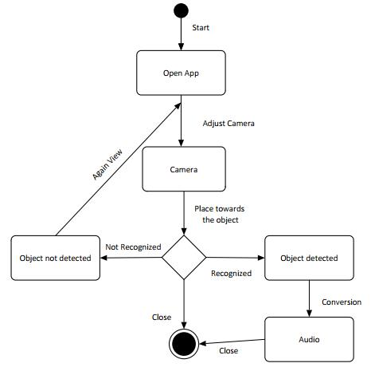
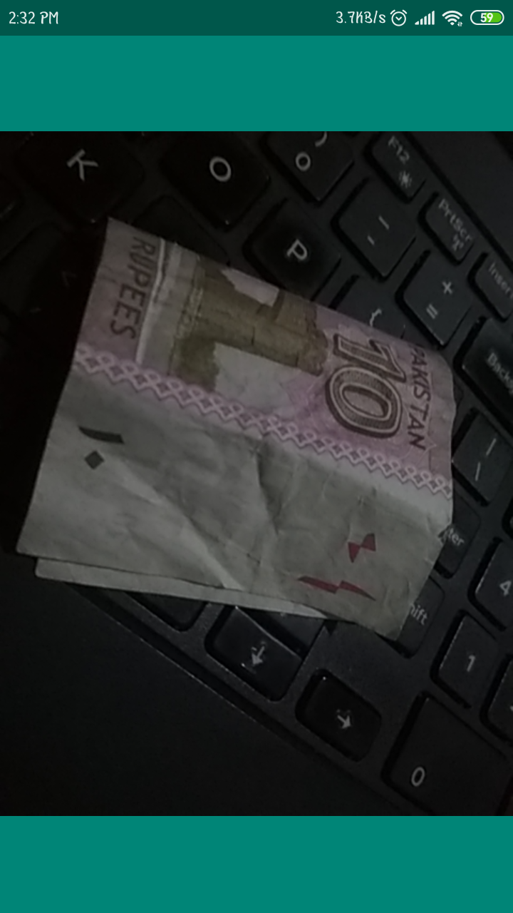

# Realtime Tensorflow Currency Recognition Android App for Blinds

I have uploaded the Dataset used at my Kaggle Account: [Dataset](https://www.kaggle.com/datasets/shehwar/pakistan-currency-pictures-dataset)

**Flow of the App:**

This App can recognize currencies of Pakistan, China and USA.  
 

**Step-1: User choose the Currency with Speech**

**Step-2: App Start Scanning for the Currency through front camera**

**Step-2 Whenever App recognizes the currency, it outputs its name through Voice feature!**

